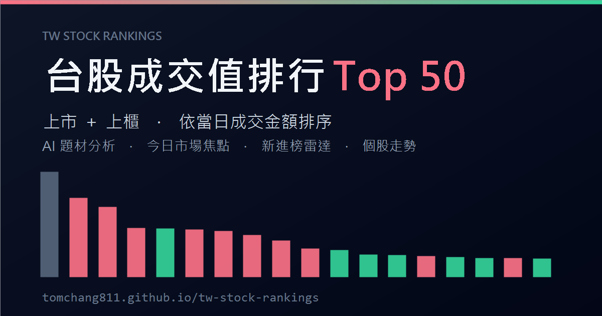

# 台股成交值排行 Top 50

**🔗 線上：https://tomchang811.github.io/tw-stock-rankings/**

台股（**上市＋上櫃**）依當日**成交金額**排序的每日排行榜，含 AI 題材／族群分析、今日市場焦點、新進榜雷達、在榜天數與個股走勢。為 **Next.js 靜態網站**，資料由每日排程預先產生為靜態 JSON，部署於 GitHub Pages。



> 改編自 [us-stock-rankings](https://github.com/usstocktop50/us-stock-rankings)（美股版）。主要差異：資料來源改為證交所／櫃買官方 OpenAPI、漲紅跌綠、新台幣 兆/億/萬 格式、TradingView 交易所前綴、台股交易時段與題材提示。

## 架構

```
前端 (src/)            靜態頁面，只 fetch 預產的 JSON：
  RankingTable ──►  public/rankings.json          最新一日排行
                    public/history/<date>.json     每日歷史快照
                    public/history/index.json      可選日期清單
                    public/history/trends.json     個股跨日走勢

資料管線 (scripts/)    每日收盤後由 GitHub Actions 執行：
  snapshot.mjs    抓上市+上櫃當日全市場 → 依成交金額排前 50 → Gemini 題材 → 寫 JSON
  backfill.mjs    回補過去 N 個交易日歷史（一次性）
  reconcile-streak.mjs  重接「在榜天數」連續鏈（純離線）
  lib/core.mjs    資料抓取 / 排名 / 產業別+市值 / Gemini / 歷史寫出
```

## 資料來源（皆免金鑰）

| 用途 | 端點 |
|---|---|
| 上市當日全市場 | `openapi.twse.com.tw/v1/exchangeReport/STOCK_DAY_ALL` |
| 上櫃當日全市場 | `tpex.org.tw/openapi/v1/tpex_mainboard_daily_close_quotes` |
| 上市產業別/股數 | `openapi.twse.com.tw/v1/opendata/t187ap03_L` |
| 上櫃產業別/股數 | `tpex.org.tw/openapi/v1/mopsfin_t187ap03_O` |
| 指定日（回補） | TWSE `MI_INDEX`；上櫃指定日為 best-effort |

- 排行只計**個股**（4 位數字代號），排除 ETF（00xxx）、權證、特別股。
- 成交金額由交易所直接公布；漲跌幅以收盤與漲跌價差換算；市值＝已發行普通股數 × 收盤價。
- **題材分析**（選用）由 Google Gemini（`gemini-2.5-flash`）+ Google 搜尋產生；未設金鑰時題材退回「產業別」。

## 本機開發

需 Node 18+（建議 22，內建 `fetch`）。

```bash
npm install

# 1) 產生最新一日資料（行情免金鑰；要 AI 題材請先設 GEMINI_API_KEY）
node scripts/snapshot.mjs

# 2) 啟動前端
npm run dev          # http://localhost:3000

# 3) 靜態匯出（產生 out/）
npm run build
```

啟用 AI 題材：複製 `.env.local.example` 為 `.env.local` 並填入 `GEMINI_API_KEY`（[Google AI Studio](https://aistudio.google.com/apikey) 免費申請），再重跑 `node scripts/snapshot.mjs`。

回補歷史走勢（一次性）：

```bash
node scripts/backfill.mjs 60   # 回補近 60 個交易日
node scripts/reconcile-streak.mjs
```

## 部署到 GitHub Pages

1. 建立 GitHub repo 並推送本專案。
2. Settings → Pages → Build and deployment → Source 選 **GitHub Actions**。
3. Settings → Secrets and variables → Actions 新增 `GEMINI_API_KEY`（要 AI 題材時）。
4. `.github/workflows/deploy.yml` 會於每個交易日台北 15:30 / 16:30 自動更新並部署，亦可在 Actions 頁手動 `Run workflow`。
5. 部署後把 `src/app/layout.tsx` 的 `metadataBase` 改成你的 Pages 網址。

> GitHub 排程偶有飄移；若需更準時，可用外部 cron（如 cron-job.org）打 `workflow_dispatch`。

## 免責聲明

本站所有數據與 AI 生成之題材／焦點分析皆為程式自動產生，**僅供參考、非投資建議**，可能延遲、不完整或有誤。投資決策請自行查證並自負風險。
